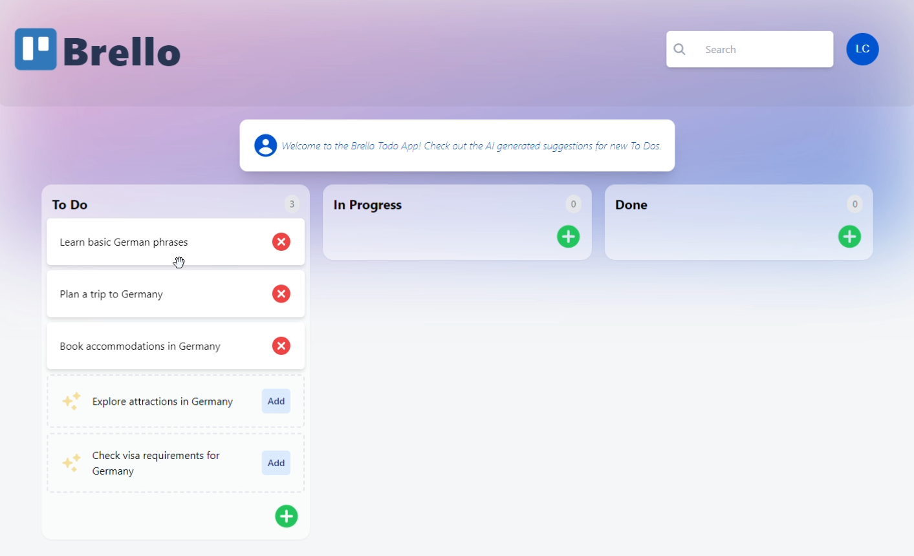

# Brello

### ⭐ Demo ⭐
- [Live Demo](https://brello.codingleo.com)

### Tech Stack

#### Frontend
-  is used for natural language processing tasks.
-  is a typed superset of JavaScript that compiles to plain JavaScript.

-  is a JavaScript library for building user interfaces.
-  is a React framework for building server-side rendered and statically generated applications.
-  is a small, fast, and scalable state management library for React.
-  is a utility-first CSS framework for building custom designs quickly.
-  is a collection of completely unstyled, fully accessible UI components for React.

#### Backend
-  is an open-source, end-to-end backend server for Web, Mobile, and Flutter developers.

#### Deployment
-  is a cloud platform for static sites and Serverless Functions that enables developers to host Jamstack websites and web services.
